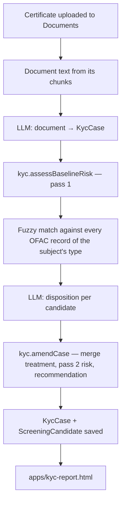

# realm-kyc-aml

KYC onboarding with AML sanctions screening for an Embabel world. Upload a company's certificate of
incorporation; the realm extracts a structured KYC case from it, screens the company against the
OFAC SDN list, has an LLM disposition each sanctions candidate, and scores risk twice — before and
after AML enrichment — with a printable report.

It is a port of the `kycdemo` pipeline in `meta-agent` (`KycAmlRiskPipelineIntegrationTest`): same
types, matcher, risk methodology and prompts, rebuilt on the realm surfaces.

## Pipeline



Deterministic code finds candidates and computes risk; the LLM extracts facts and assesses
ambiguous candidates; it never makes the onboarding decision. Candidates stay *possible matches*
until an analyst confirms or clears them, and the KYC subject's identity is never overwritten by a
sanctions record.

## What is in here

| Path | What |
|---|---|
| `lenses/kyc-screen-certificate.yml` | The pipeline. Takes `document` (upload file name, `upload://…` URI, or title). Holds the two LLM prompts and the sanctions matcher. |
| `wasm/handlers.js` + `dist/manifest.json` | `kyc.assessBaselineRisk` and `kyc.amendCase`: baseline risk, required-field issues, merge treatment, final risk, recommendation, compliance actions. |
| `types/` | `KycCase`, `ScreeningCandidate`, `SanctionsListShard`. |
| `views/kyc.yml` | `KycCases`, `KycCasesNeedingReview`, `KycCaseCandidates`, `KycCaseReport`, `SanctionsListsLoaded`. |
| `apps/kyc-report.html` | Upload → screen → report; save as HTML or print to PDF; reopen any case. Served at `/apps/kyc-aml/kyc-report.html`. |
| `skills/kyc-aml-screening/` | How the assistant runs and explains screening. |
| `reference/ofac-sdn-*.yml` | The OFAC SDN list, generated — do not edit. |
| `scripts/build-ofac-reference.py` | Builds `reference/` from `sdn.xml`. |

## Updating the sanctions list

```bash
curl -o sdn.xml https://www.treasury.gov/ofac/downloads/sdn.xml
scripts/build-ofac-reference.py sdn.xml     # rewrites reference/ofac-sdn-*.yml
```

Then refresh the realm. Records are keyed, so re-seeding replaces the old list. The app header and
the `SanctionsListsLoaded` view show the publish date a screen was run against — a CLEAR result is
only as current as that date.

## Design notes

- **Why the matcher runs in the lens, not a wasm handler.** Scoring ~10k list records takes well
  under a second in the lens's sandbox. In a wasm handler, moving the list across the host
  boundary and interpreting the matcher measured at well over the 30 s dispatch budget. The cheap,
  deterministic scoring and amendment stay in wasm.
- **Why the list is sharded.** The host upserts reference records with a label scan, so one node
  per list record (19k) seeds quadratically — about an hour, on every world rebuild. A few hundred
  shard nodes seed in seconds.
- **Reading an upload's text.** Chunk lookup matches `root_document_uri` on the URI *without* its
  `upload://` scheme and then checks the returned value exactly: inside a query the engine compares
  against a scoped form of that property, and a predicate containing the scheme never matches.
- **Country codes** are normalized to ISO alpha-2 when the list is built and when the subject is
  extracted, so the matcher compares codes, not spellings.

## Methodology (demo calibration, not regulatory constants)

- Name similarity: max(token Jaccard, normalized edit similarity) over primary names and aliases,
  noise words (`limited`, `ltd`, `inc`, …) removed; candidate at ≥ 0.72.
- Disposition: *confirmed* needs name ≥ 0.95, identifier score ≥ 0.85 and a matching registration
  number or date of birth; *likely false positive* needs two conflicting identifier kinds;
  otherwise *possible*.
- Risk levels LOW 20 / MEDIUM 55 / HIGH 90 / UNKNOWN 50; weights ownership 30, geography, source of
  funds, source of wealth and AML/sanctions 15 each, document quality 10. Overall risk is the most
  severe factor.
- AML sanctions factor after screening: HIGH for a confirmed match or LLM confidence ≥ 0.6,
  MEDIUM ≥ 0.4, LOW when nothing matched.
- Country risk: demo table (EU/UK/Nordics LOW, HK MEDIUM, everything else UNKNOWN).

Externalize and calibrate all of these before using the realm for real decisions.
